# Webmap Development #CODEX
[CODEX: **COD**ing **EX**perience]

Tutorial membangun __*webmap*__ sederhana yang memuat dan menampilkan data [Overture Maps Foundation](https://overturemaps.org/), dengan menggunakan [Next.js](https://nextjs.org/), [TailwindCSS](https://tailwindcss.com/), [shadcn/ui](https://ui.shadcn.com/), dan [OpenLayers](https://openlayers.org/).

## *Create* Proyek Next.js
Untuk mengawali sebuah proyek Next.js, Anda dapat membuat sebuah direktori kosong di dalam *home directory*, dan masuk ke dalam direktori kosong tersebut.
```shell

mkdir project

cd project
```
Jalankan command berikut:
```shell

npx create-next-app@latest
```
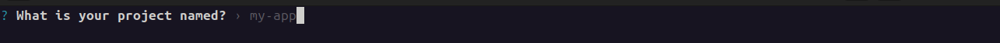
Saat muncul akan dinamai apa proyeknya, tuliskan nama proyek Anda dan tekan `Enter`. Dalam contoh, proyek akan dinamai: `webmap-nextjs`.

Catatan: Nama proyek sebaiknya menggunakan `lowercase`, hindari spasi, dan lebih baik menggunakan `-` atau `_` jika butuh pemisahan kata.
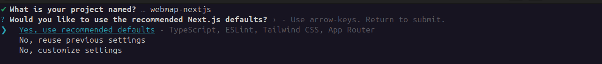

Berikutnya akan muncul pilihan konfigurasi *default* proyek Next.js. Saat muncul pilihan seperti ini, dengan menggunakan *keyboard* pilih: `No, customize settings`:
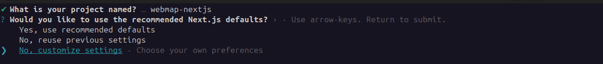
Berikutnya akan muncul pilihan:

`TypeScript`:
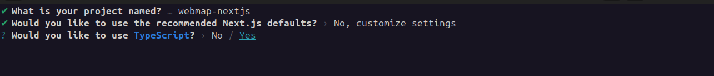
Pilih: `Yes`.

`ESLint`
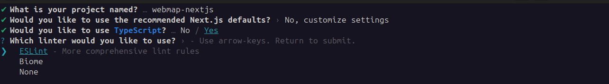
Pilih `ESLint`.

Berikutnya akan muncul pilihan:

`React Compiler`:
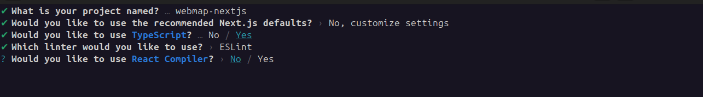
Pilih `No`.

`Tailwind CSS`
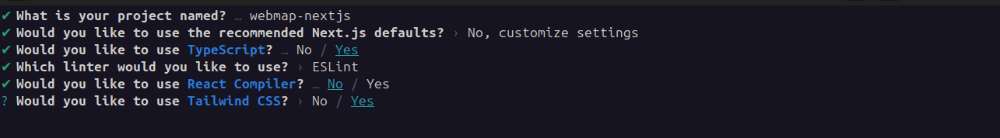
Pilih `Yes`.

Berikutnya akan muncul apakah seluruh kode Anda akan berada di dalam direktori `src/`:
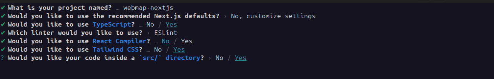
Pilih `Yes`.

`App Router`
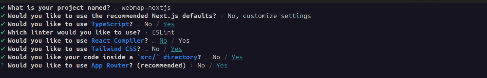
Pilih `Yes`.

`import alias`
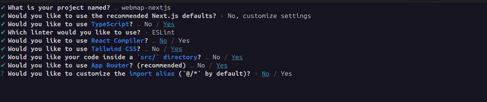
Pilih `No` (berarti Anda akan menggunakan *default*, yaitu `@/*`).

Setelah Anda menekan `Enter` pada `Yes`, maka proses `create` akan berjalan:
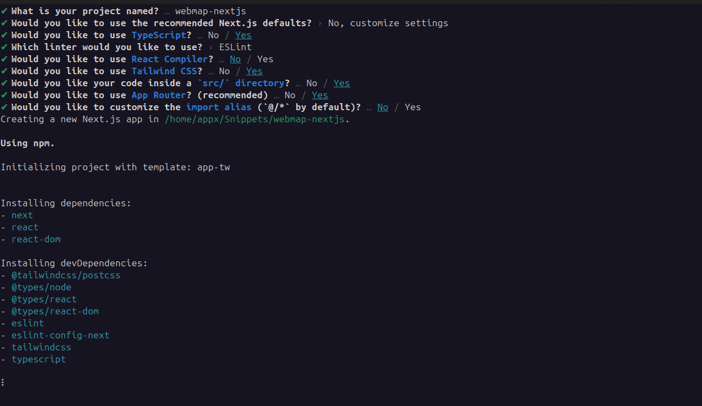

Jika proses *create* sudah selesai, maka akan muncul:
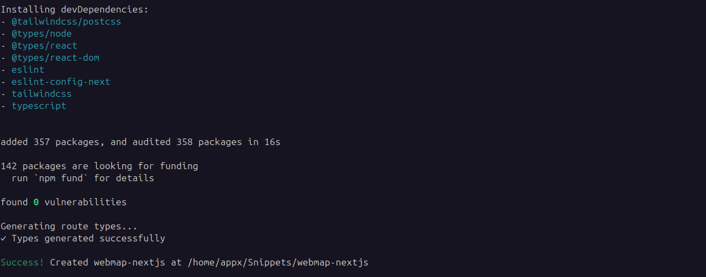

Langkah selanjutnya adalah masuk ke direktori proyek yang sudah Anda buat. Nama direktori akan sesuai dengan nama proyek yang tadi di awal sudah Anda tulis. (Dalam contoh ini: `webmap-nextjs`)
```shell

cd webmap-nextjs
```

Penting: Untuk menghindari kompleksitas, lebih baik mengulang / me-*reset* proyek yang saat ini menggunakan `npm` sebagai basisnya, menjadi `yarn`. Langkah yang bisa Anda laksanakan:
Hapus direktori `node_modules` dan file `package-lock.json` dalam direktori proyek.
```shell

rm -rf node_modules

rm -rf package-lock.json
```

Selanjutnya, jalankan *command* `yarn` untuk membangun-ulang direktori `node_modules`:
```shell

yarn
```
Catatan: Dalam proses membangun-ulang direktori `node_modules` dengan menggunakan *Yarn*, `lock` file yang akan secara otomatis di-*generate* bukan `package-lock.json`, melainkan `yarn.lock`.

Untuk test, jalankan *command*:
```shell

yarn dev
```
dan buka URL: `http://localhost:3000` di *browser* Anda.
